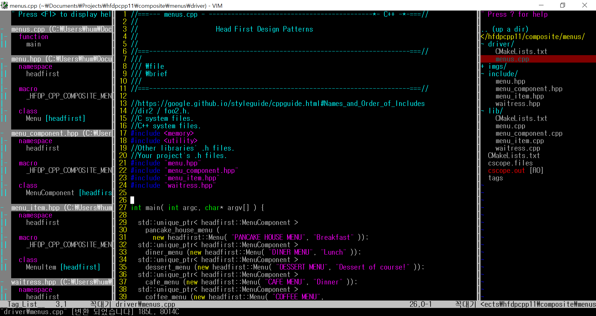

On Ubuntu
---------

.. image:: docs/_static/imgs/screen_.jpg
   :scale: 50 %
   :alt: screen capture in ubuntu

On Windows
---------

News
====

- `Wiki <https://github.com/Jeonghum/vimrc/wiki>`_ is added   2018.4.5
- `Github Page <http://jeonghum.github.io/vimrc/>`_ is added   2013.5.26
- Install script(install.sh) is added     2013.1.31
- LLVM vimrc is added                     2013.1.30
- LICENSE of LLVM is added and applied    2013.1.30
- Install Guide is updated                2013.1.30

About
=====

.vimrc
------

- Makes vim more useful to work on C/C++/Java projects
  (and possibly other projects too)
- Includes many useful short-cut key mappings
- Includes many useful vim plugins (via Vundle)

mkcscope.sh
-----------

- Script to generate cscope.out

mkctags.sh
----------

- Script to generate ctags

rmtags.sh
---------

- Script to remove ctags, cscope.out and cscope.files

.cncpp.vimrc
-----------

- Place anything related with C/C++ programming

.project.vimrc
--------------

- Place anything related with a certain project i.e. include directory and
  paths for tags and cscope.out for libraries related with a certain project

.system.vimrc
--------------

- Place anything related with a certain OS system i.e. the paths for C++
  standard header files

Testing environment
-------------------

- Ubuntu and Windows

Prerequisite
------------

- on Linux : git-core vim cscope (exuberant-ctags or universal-ctags: universal
  one seems better but sometimes it is unstable so I prefer exuberant one)
- on Windows : gvim, 7zip and git

Note
----

How to install is explained in wiki.

Using scripts
=============

There is a rule to use these scripts.

- Generate ctags and cscope.out (by running mkcscope.sh and mkctags.sh)
  in a top directory of your project
::

 $ mkctags.sh
 $ mkcscope.sh

To close cscope after cscope finished it's job, press CTRL+D.

- Open vim from the top directory of your project

If you open vim other places than where those tags files exist,
vim cannot use those tags files.

If you don't need to use tags files along with vim,
you can open vim anywhere you want.

References
==========

- http://kldp.org/node/125263
- http://kldp.org/
- http://stackoverflow.com/
- http://kangcom.com/sub/view.asp?sku=201008310017&mcd=571

Jeonghum Joh

